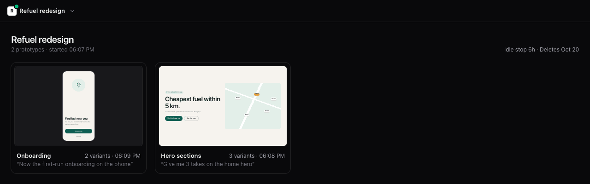
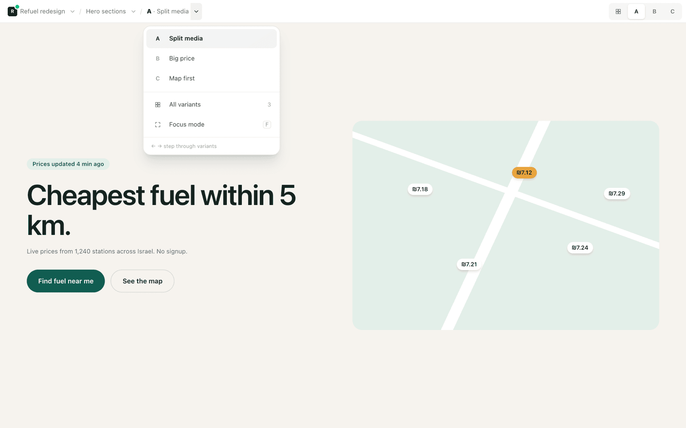
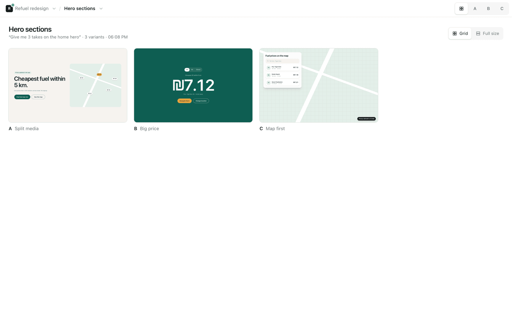
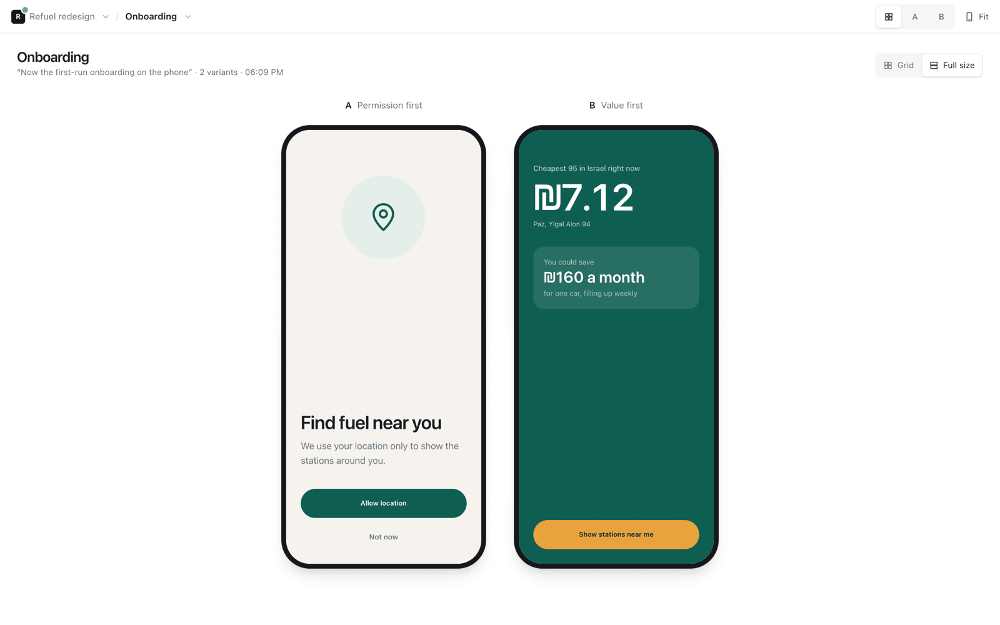
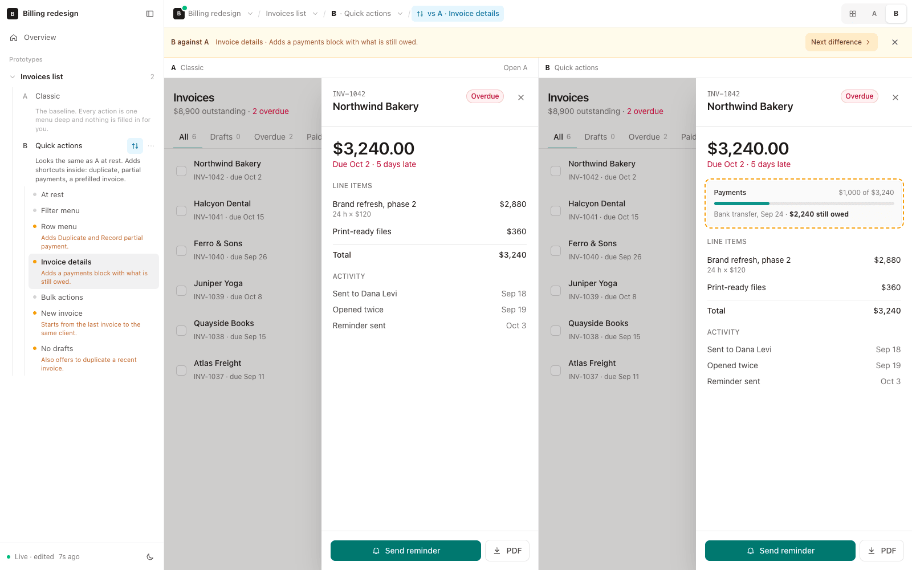
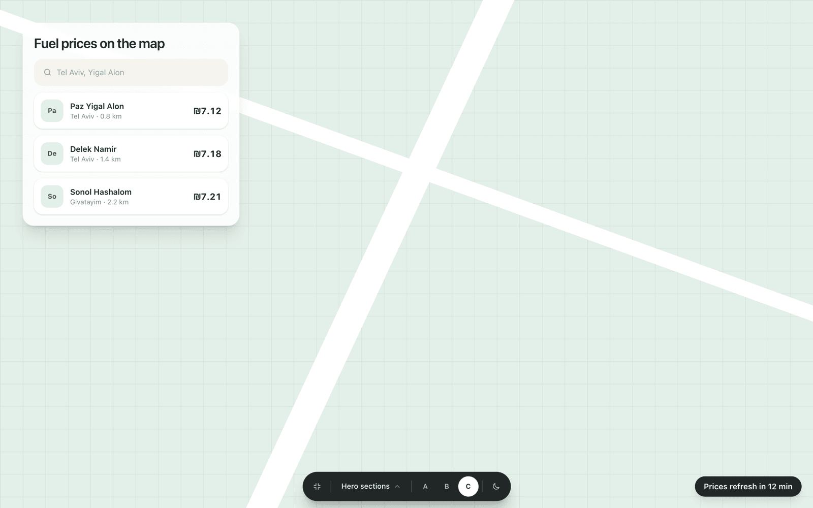
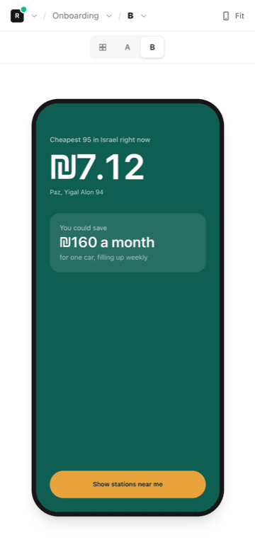
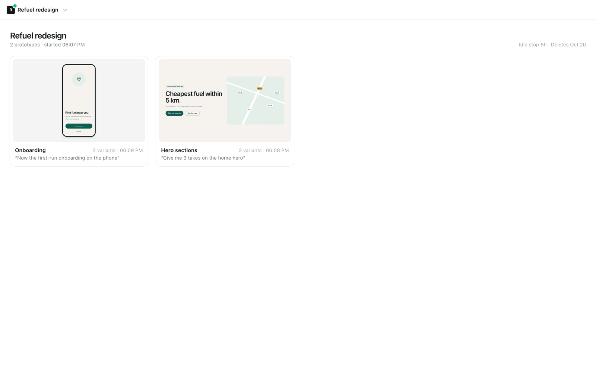

# Prototype

A Claude Code plugin that turns "show me a few versions of this" into real, clickable variants you watch being built, live, in one app per session.



- **One link per session.** Claude starts a small app before it designs anything and sends you the link. It opens on your phone too.
- **Live, no reloads.** Every variant shows up as a placeholder and fills in through hot module replacement the moment its file is written.
- **Built from your product.** When the request changes something that ships, the first variant is "Current": a rebuild of today's screen from your real assets, tokens and component sizes, checked against a screenshot of the real app until they match. Every other variant starts as a copy of it, so they all look like your app, native apps included. The app follows your stack (React or Vue) and can import your web components, so the winner is close to drop-in.
- **Right to left, built in.** Hebrew and Arabic products are laid out right to left from the first line: logical sides only, mirrored arrows and progress, numbers and Latin kept left to right, real copy. `proto shoot` lists any left or right left behind.
- **A pick, not a pile.** Claude screenshots every variant, fixes what it sees over two rounds, then recommends one and says why.

## Install

In Claude Code:

```
/plugin marketplace add DananzMolt/prototype-skill
/plugin install prototype@prototype-skill
```

To get updates automatically, open `/plugin`, go to **Marketplaces**, pick `prototype-skill` and choose **Enable auto-update**. Otherwise, to get the latest, choose **Update marketplace** there, or run `claude plugin update prototype@prototype-skill` in a terminal.

**Runs on** macOS, Linux and Windows (PowerShell or Git Bash). **Needs** Node 22+, pnpm or npm, and Chrome for screenshots (Chromium or Edge work too; set `CHROME` to a browser's path to pick one). For the link on your phone, [Tailscale](https://tailscale.com) too.

<details>
<summary>Without the plugin system</summary>

Clone it as a personal skill and update it with `git pull`:

```sh
git clone https://github.com/DananzMolt/prototype-skill ~/.claude/skills/prototype
```

In PowerShell:

```powershell
git clone https://github.com/DananzMolt/prototype-skill "$HOME\.claude\skills\prototype"
```
</details>

## Use

```
/prototype the checkout page
/prototype 3 empty states for the inbox
/prototype a pricing section, then build the best one
```

Or just ask: "show me a few versions of the settings drawer". `/prototype` works when nothing else uses the name; `/prototype:prototype` always does.

Keep going in the same session and everything lands in the same app, under the same link:

| You say | You get |
|---|---|
| "two more heroes" | D and E next to A, B, C |
| "now the pricing page" | a new prototype in the same app |
| "B, but with a map" | new variants built from B |
| "take B's hero further" | a new prototype nested under B, then its CTA under that |
| "try it on the phone" | the variants in phone frames |
| "build the winner" | the real feature in your codebase, with screenshots |
| "go with A" | A is marked as picked in the page, the others stay |
| "make B's price bigger" | the change, kept under "What you asked for" on B's card |
| "put these in a doc I can share" | a Claude Doc with a static snapshot of each variant |

## What you get

### Every variant is a real page

Breadcrumbs go session › prototype › variant. Each name opens an overview, each chevron jumps anywhere, and the tabs or the arrow keys step through variants. On a phone the tabs become one pill at the bottom of the stage: drag along it and the designs slide past under your finger, one phone apart at the phone scale you set, or tap it for a sheet of every variant. The phone's bar keeps three things: back to what the prototype was built from, its title (tap for the other prototypes) and the session behind ⋯. The phone scale sits in the pill, with its sizes and a slider growing out of the button. A sidebar shows the same thing as a tree. A prototype built from part of another variant (its hero, then that hero's CTA) is a row under the variant it came from; open it and the sidebar shows only that branch, with what it was built from listed one line per level, so five levels deep reads as easily as one. Hide the sidebar with ⌘\ for breadcrumbs alone.

### Working on one variant

Once you pick a direction and keep asking for changes, that variant is pinned at the top of the sidebar. From anywhere, one click or W brings you back. On it, the card lists what you asked for, what was built from it, its sibling variants (Hide others takes them out of the tabs and the tree) and what you worked on before. When Claude moves on to another variant, the card follows and offers Undo.

<picture>
  <source media="(prefers-color-scheme: dark)" srcset="docs/images/menu-dark.png">
  
</picture>

### Compare them side by side, or at full size

The prototype page shows every variant as a live thumbnail, or one after another at full size so you can click through each.

<p>
<picture>
  <source media="(prefers-color-scheme: dark)" srcset="docs/images/grid-dark.png">
  
</picture>
<picture>
  <source media="(prefers-color-scheme: dark)" srcset="docs/images/fullsize-dark.png">
  
</picture>
</p>

### See what's behind the clicks

Menus, drawers and steps inside a variant are listed under it in the sidebar, each with a line on what it is or what this variant changes (in amber). Click one and the variant opens in that state. The ⋯ on a variant's row has three more ways in: Autoplay clicks through every state for you, All states shows them on one page, and Compare puts two variants side by side in the same state, with what one adds outlined.

<picture>
  <source media="(prefers-color-scheme: dark)" srcset="docs/images/states-dark.png">
  
</picture>

### Try it, beside the design

A variant can say what a reviewer needs to get through it, and the page shows it in a panel at the stage's right edge: values to type (a demo login, a 2FA code that changes every 30 seconds), each copied with a click or typed in with Fill in, things to try that tick themselves off and, when you point at one, light up where on the design it happens (the rest dims, a label says Click, Grab and Drop or Press ⌘ K, and an arrow draws a drag), scenario switches (empty, busy, an error), events from outside (a message arrives, a payment fails) and what the prototype doesn't do. The design narrows beside it instead of being covered; on a phone it opens over the design, and closed it is a tab on the edge. Screenshots leave it out.

### Focus mode

Press `F` and the chrome disappears. A small dock stays at the bottom and grows as your pointer gets close; edge arrows appear near the sides.

<picture>
  <source media="(prefers-color-scheme: dark)" srcset="docs/images/focus-dark.png">
  
</picture>

### On your phone

The link works on any device on your tailnet, and phone prototypes sit in a real phone frame, sized to your device (393×852 unless the screenshots say otherwise).

<p>
<picture>
  <source media="(prefers-color-scheme: dark)" srcset="docs/images/phone-dark.png">
  
</picture>
<picture>
  <source media="(prefers-color-scheme: dark)" srcset="docs/images/session-dark.png">
  
</picture>
</p>

## How Claude uses it

1. Starts the session app and sends you the link.
2. Screenshots the real screen, rebuilds it as "Current" from your assets, tokens and component source, and compares the two side by side and overlaid until they match. Then writes down what the feature must do.
3. Picks genuinely different directions, each a copy of Current, (where it lives, how it's triggered, how much it shows), five unless you say otherwise.
4. Writes each variant into the app, and lists what's behind its clicks; you watch them land.
5. Screenshots every variant on desktop and phone (a phone prototype: phone only), fixes what breaks, two rounds.
6. Recommends one, says why, and what to take from the others.

## Where things go

Each session's app lives in `<project>/.prototypes/<session>/`, git-ignored, with its own dependencies. Your project's files are never touched.

| When | What happens |
|---|---|
| No edits and no open page for 6 hours | the server stops; asking again restarts it on the same link |
| Every prototype picked or archived, and no open page for 30 minutes | the server stops sooner, since nothing is left to decide |
| A session untouched for 14 days | it's deleted, unless you pressed **Keep** in the session menu |
| You say you're done | Claude stops it; the files stay |

### Light on your machine

A design's code loads the first time it's shown, so picked, archived and unopened prototypes cost nothing. Overviews run only the previews on or near the screen. A running session's server idles at about 200 MB with no CPU, and its memory is capped at 1 GB. A tab left open through hundreds of edits reloads itself while hidden, to free the old versions the browser keeps. `.github/stress.mjs` measures all of it: 40 prototypes × 20 heavy variants, edit storms, and navigating through every variant.

## What's inside

| Path | |
|---|---|
| `SKILL.md` | What Claude does, step by step |
| `scripts/proto.mjs` | Session manager: `up`, `add`, `shoot`, `snap`, `archive`, `stop`, `rm`, `keep`, `ls`, `gc` |
| `scripts/shoot.mjs` | Desktop and phone screenshots of the stage (no sidebar or bars) through headless Chrome, and with `--ref` a variant beside and over a screenshot of the real screen |
| `scripts/snap.mjs` | Static HTML snapshots of variants, for sharing in a Claude Doc |
| `scripts/chrome.mjs` | Finds Chrome, Chromium or Edge for the two above |
| `app/` | The template each session app is copied from (Vite, Tailwind, the shell, React and Vue adapters, and `useHints` for the Try it panel) |
| `.claude-plugin/` | Plugin and marketplace manifests |

## License

MIT
