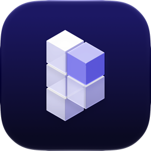

<div align="center">

<picture>
  <source media="(prefers-color-scheme: dark)" srcset="docs/images/icon-light.png">
  
</picture>

# Prototype

**Several live, clickable versions of any UI, built while you watch.**

[](#install)
[](https://github.com/DananzMolt/prototype-skill/actions/workflows/smoke.yml)
[](LICENSE)
[](#install)

[Install](#install) &middot; [Use](#use) &middot; [Features](#features)

</div>

Prototype is a skill for Claude Code. Ask for a few versions of a screen and Claude opens one live app for your session, sends you its link, and builds five different takes into it while you watch. Each one starts from a faithful rebuild of your real screen, so they all look like your product. Then Claude checks its own screenshots and tells you which one it would ship, and why.

<div align="center">

</div>

## Install

**From the plugin marketplace**, in Claude Code:

```
/plugin marketplace add DananzMolt/prototype-skill
/plugin install prototype@prototype-skill
```

**Or let Claude do it.** Paste this into Claude Code:

```
Install the Prototype plugin: run `claude plugin marketplace add DananzMolt/prototype-skill`
and `claude plugin install prototype@prototype-skill`. Then check that Node 22+, pnpm or npm,
and Chrome (or Chromium or Edge) are installed, and tell me if anything is missing or if I
need to restart Claude Code.
```

Runs on macOS, Linux and Windows. Needs Node 22+, pnpm or npm, and Chrome, Chromium or Edge for screenshots. Add [Tailscale](https://tailscale.com) to open the link on your phone. To stay up to date, turn on auto-update for `prototype-skill` under `/plugin` → Marketplaces.

<details>
<summary>Without the plugin system</summary>

```sh
git clone https://github.com/DananzMolt/prototype-skill ~/.claude/skills/prototype
```

Update it with `git pull`. In PowerShell, clone into `"$HOME\.claude\skills\prototype"`.
</details>

## Use

```
/prototype the checkout page
/prototype 3 empty states for the inbox
```

Or just ask for "a few versions of the settings drawer". Keep talking in the same session and everything lands in the same app:

| You say | You get |
|---|---|
| "two more" | D and E next to A, B and C |
| "B, but with a map" | new variants built from B |
| "go with A" | A marked as the pick |
| "build it" | the real feature in your codebase |

## Features

### Live
- One app and one link per session, which opens on your phone too.
- Each variant appears as a placeholder and fills in the moment Claude writes it. No reloads.

### Built from your product
- Variant A, "Current", rebuilds today's screen from your real assets, colors and sizes, checked against a screenshot until they match. Every other variant starts from it.
- Follows your stack (React or Vue), and lays out Hebrew and Arabic right to left from the first line.

### Made for reviewing
- Step through the variants, see them side by side or full size, or hide everything but the design.
- Open menus, drawers and steps from a list, autoplay them, or compare two variants in the same state.
- A Try it panel tells you what to type and where to click.
- Comment on any part of a design. Claude makes the change and replies.

### A pick, not a pile
- Claude screenshots every variant on desktop and phone, fixes what it sees over two rounds, then recommends one and says why.

## Screenshots

<p align="center">
<picture>
  <source media="(prefers-color-scheme: dark)" srcset="docs/images/grid-dark.png">
  
</picture>
<picture>
  <source media="(prefers-color-scheme: dark)" srcset="docs/images/states-dark.png">
  
</picture>
<br><sub>Every variant side by side, and two of them compared in the same state.</sub>
</p>

## How it works

Each session's app lives in `<project>/.prototypes/<session>/`, git-ignored, so your project's files are never touched. It stops after 6 hours with nothing open and comes back on the same link when you ask again. Sessions untouched for 14 days are deleted unless you keep them.

## Contributing

Issues and pull requests are welcome. `SKILL.md` is what Claude follows, `scripts/proto.mjs` runs the sessions, and `app/` is the template each session starts from.

## License

[MIT](LICENSE) © Tomer Danan
